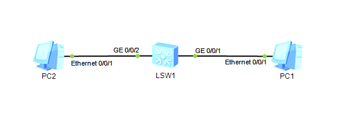
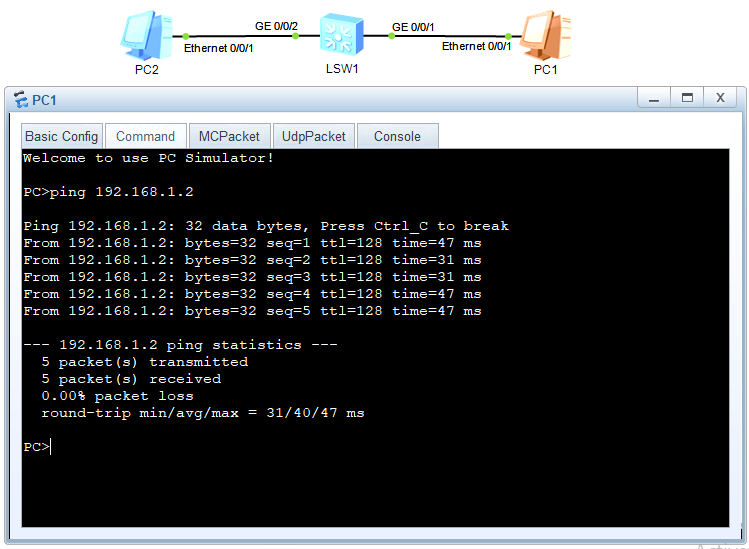

# Lab 01 - Basic Connectivity & Ping Test

## Objective
Configure end devices with IP addresses and verify connectivity using Ping.

## Topology

## Devices Used
- PCs (End Devices)
- Switch (Layer 2 Switch)

## Key Configurations
- Assigned IP addresses to PCs
- Configured subnet mask
- Connected devices through a switch
- Tested connectivity

## Verification
Successful Ping between devices via the switch.

## Skills
IP Addressing, Connectivity Testing, Switching Basics, Troubleshooting
