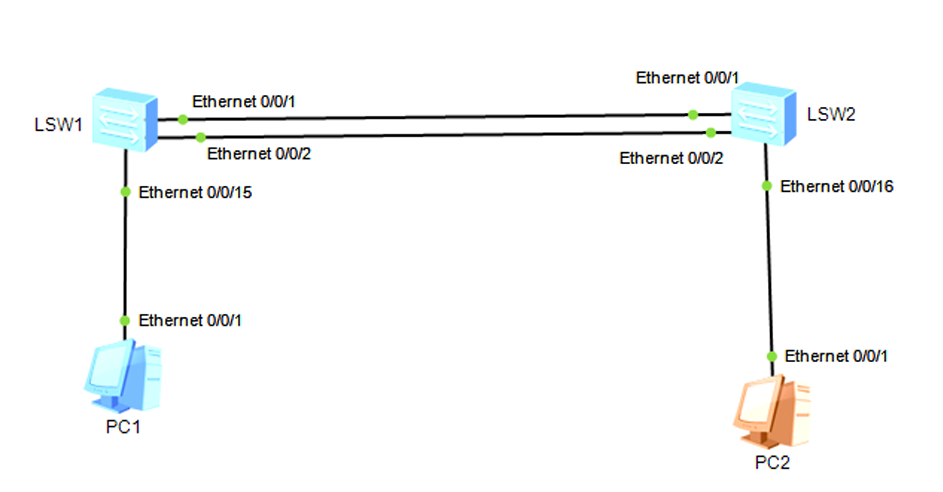

---

# 📁 Lab-04-EtherChannel-EthTrunk


```md
# Lab 04 - Link Aggregation (Eth-Trunk)

## Objective
Create an Eth-Trunk between two switches for redundancy and increased bandwidth.

## Topology


## Key Configurations

```bash
interface eth-trunk 1

interface ethernet 0/0/1
eth-trunk 1

interface ethernet 0/0/2
eth-trunk 1
